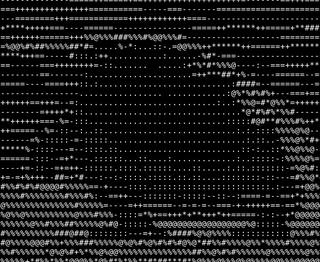

# 0vervv
TUI terminal image viewer (mostly grey)

# Compile

```bash
make -j8  # 8 cores/threads to use in parallel compile
sudo/doas make install
```

# Requirements

In Debian it's `sudo apt install libopencv-dev libncurses5-dev libncursesw5-dev`, in your other OS's search for `lib opencv and lib ncurses`.